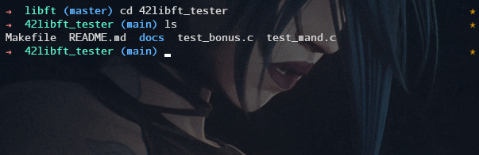
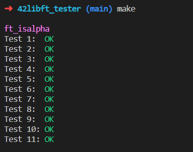
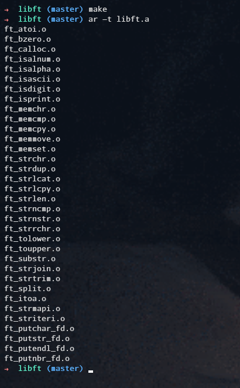
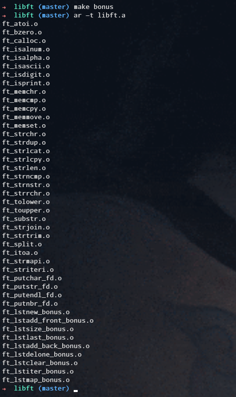

# Testes para o projeto _libft_

A fim de testar o negocio, clone o repo dentro do seu projeto _libft_:
```sh
git clone https://github.com/ichmi/42libft_tester.git
```
Feito isso, basta ir ate o diretorio _`42libft_tester`_ e executar o comando **`make`**. Por padrao, o comando ira compilar a sua _libft_ com as partes 1 e 2 + Bonus part:



Caso prefira executar apenas as partes 1 e 2 do projeto, basta executar a regra `m` (Mandatory):
```sh
make m
```

PS: O teste depende do seu _Makefile_ para montar a _libft_, portanto certifique-se de que ele esteja funcionando de forma adequada, pois o _Makefile_ do teste depende do _Makefile_ do seu projeto. Caso vc ainda nao tenha feito a Bonus part, execute **`make m`** instead.

Uma vez executado o `make`, o teste ira encarregar-se de executar o binario _`test_exe`_ do qual possue os testes para suas funcoes _`ft_`_ s, linkando-os com sua biblioteca (criada atraves de suas proprias regras do _Makefile_ do seu projeto _libft_). O _Makefile_ do teste apenas linka sua biblioteca (_static_) com o respectivo arquivo de testes. Por exemplo, um **`make m`** ira usar a biblioteca da seguinte maneira:


Quanto um **`make`** / **`make b`** inclui os bonus as well:


Feel free em adicionar novos testes ou reportar bugs, e tambem em enviar-me msg.

Perfil intra/disc: **`frosa-ma`**
